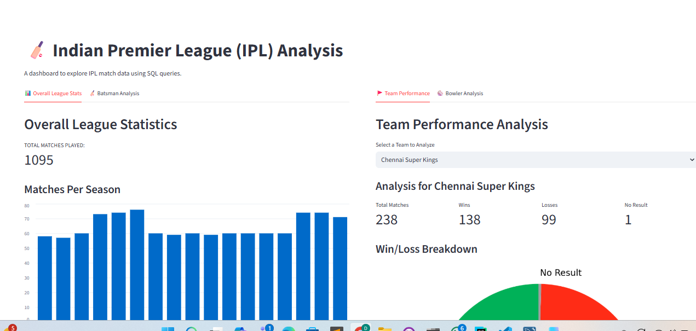

# 🏏 IPL (Indian Premier League) Analysis Dashboard

This project is an interactive web dashboard for analyzing data from the Indian Premier League (IPL). It is built entirely in Python using Streamlit, Pandas, and an in-memory SQLite database for on-the-fly data querying and analysis.

This dashboard allows users to explore overall league statistics, dive into team-specific performance, and analyze individual batsman and bowler stats.




---

## Features

The dashboard is organized into several key analysis sections:

### 📊 Overall League Stats
* **Total Matches Played:** A high-level metric of all matches in the dataset.
* **Matches Per Season:** A bar chart visualizing the number of matches played each year.
* **Top 10 Players:** A bar chart of the players with the most "Player of the Match" awards.

### 🏏 Batsman Analysis
* **Select any Batsman:** A dropdown menu to select any batsman from IPL history.
* **Boundary Breakdown:** Metrics for total 4s and 6s.
* **Pie Chart:** A pie chart visualizing the ratio of 4s to 6s for the selected player.

### ⚾ Bowler Analysis
* **Select any Bowler:** A dropdown menu to select any bowler.
* **Career Stats:** Metrics for total wickets taken and total overs bowled.
* **Wicket Type Breakdown:** A pie chart showing the types of dismissals (e.g., 'caught', 'bowled', 'lbw') for the selected bowler.

### 🚩 Team Performance
* **Select any Team:** A dropdown to analyze a specific team's performance.
* **Win/Loss Stats:** Metrics for Total Matches, Wins, Losses, and No Result.
* **Win/Loss Pie Chart:** A visualization of the team's overall win/loss ratio.
* **Top Winning Venues:** A bar chart showing the 10 venues where the team has won the most.

### 🪙 Toss Analysis
* **Toss Decisions:** A pie chart showing the league-wide preference for 'bat' vs. 'field'.
* **Toss vs. Match Winner:** A metric and bar chart analyzing how often the team that wins the toss also wins the match.

### 🏆 Season-by-Season Winners
* **Select any Season:** A dropdown menu to see the final results for any year.
* **Full Awards:** Displays the **Winner**, **Runner-up**, **Player of the Tournament**, **Purple Cap** winner, and **Emerging Player** for the selected season.

### ⚔️ Head-to-Head (H2H) Analysis
* **Select Two Teams:** Dropdown menus to select any two teams for comparison.
* **H2H Metrics:** Displays the total matches played between them and the number of wins for each team.

---

## 🛠️ Tech Stack

* **[Streamlit](https://streamlit.io/):** For the web app framework and UI.
* **[Pandas](https://pandas.pydata.org/):** For data loading and transformation.
* **[SQLite3](https://www.sqlite.org/index.html):** (Python's built-in library) For the in-memory SQL database.
* **[Matplotlib](https://matplotlib.org/):** For generating pie charts.

---

## 🚀 How to Run Locally

### 1. Prerequisites
* Python 3.8+
* `git` (for cloning)

### 2. Clone the Repository
```bash
git clone [https://github.com/Loitongbam-David/ipl_analytic.git]
cd ipl_analytic.git
### 3. Create a virtual environment
python -m venv venv
# On Windows
venv\Scripts\activate
# On macOS/Linux
source venv/bin/activate
### 3. Install the requirement
pip install streamlit pandas matplotlib
### 4. RUN the following code
streamlit run app.py
